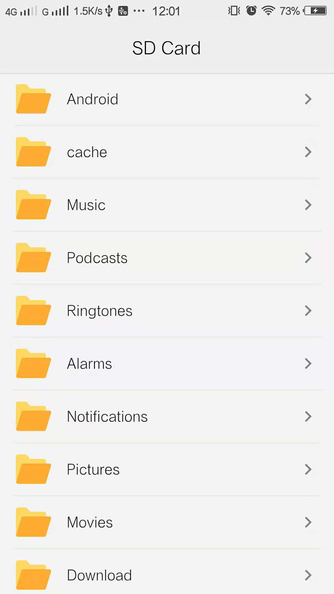

# Flutter File Share Application

Flutter File Share App using SMB

``` dart
Future<void> initDirectory(String path) async {
    try {
      setState(() {
        var directory = Directory(path);
        count = 0;
        parentDir = directory;
        files.clear();
        files = directory.listSync();
        controller.jumpTo(0.0);
      });
    } catch (e) {
      print("Directory does not exist！");
    }
  }
```

``` dart
MethodChannel _channel = MethodChannel('openFileChannel');

openFile(String path) {
    final Map<String, dynamic> args = <String, dynamic>{'path': path};
    _channel.invokeMethod('openFile', args);
  }
```
``` java
private void openFile(Context context, String path) {
        try {
            if (!path.contains("file://")) {
                path = "file://" + path;
            }
            String[] nameType = path.split("\\.");
            String mimeType = MimeTypeMap.getSingleton().getMimeTypeFromExtension(nameType[1]);

            Intent intent = new Intent();
            intent.addFlags(Intent.FLAG_ACTIVITY_NEW_TASK);
            intent.setAction(Intent.ACTION_VIEW);

            intent.setDataAndType(Uri.parse(path), mimeType);

            context.startActivity(intent);
        } catch (Exception e) {
            System.out.println(e);
        }
    }
```


